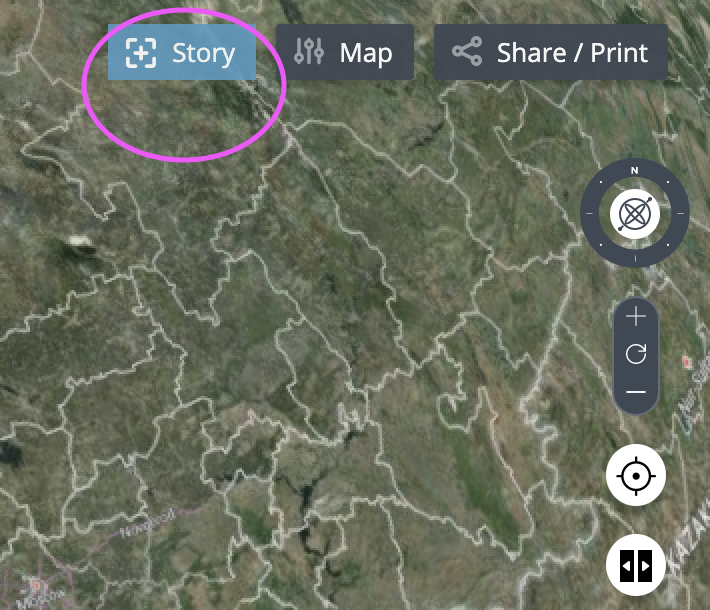

# Adding a catalog item based on a CSV file to a Terria Map

1. Terria catalog items use a JSON format. If you haven't used JSON before, have a look [here](https://blog.scottlowe.org/2013/11/08/a-non-programmers-introduction-to-json/) for a quick introduction.  Open `TerriaMap/wwwroot/init/foss4g.json` in a text editor and have a look at the current catalog:

```json
{
  	// Lat/Lon bounding rectangle of default view when a map is opened
    "homeCamera": {
      "north": 68,
      "east": 49,
      "south": 36,
      "west": -20
    },
    "catalog": [
      // Put your catalog items in here
    ]
}
```

Open `TerriaMap/wwwroot/data/cheese_production.csv` in Microsoft Excel or a text editor. You can see it has a couple of columns, including a `cnt2` column specifying a country code, and columns labelled with years containing cheese production output amounts for each country.

Terria can automatically map data to regions to make choropleth maps. It uses column names to determine what sort of region codes a CSV file is using. For more information on how Terria interprets CSV files for region mapping, check out the documentation [here](https://github.com/TerriaJS/nationalmap/wiki/csv-geo-au).

2. Modify your `foss4g.json` file so that it looks like this:

```json
{
    "homeCamera": {
      "north": 68,
      "east": 49,
      "south": 36,
      "west": -20
    },
    "catalog": [
        {
          "name": "Production of cheese (in 1000s t)",
          "type": "csv",
          
          // can be a website url, or a path to a file in the wwwroot directory of the map
           "url": "data/cheese_production.csv",
  
           // These will appear in the catalog item's description. `name` specifies the heading, and `content` the content.
           "info": [
             {
              "name": "Attribution",
              "content": "Data sourced from the [EU Open Data Portal](http://data.europa.eu/euodp/en/data/dataset/ZWo26z1CgQTGQMwte8QVBQ)"
             },
             {
               "name": "License",
               "content": "[Creative Commons Attribution 4.0 International (CC BY 4.0)](https://creativecommons.org/licenses/by/4.0/)"
             }
  
           ]
        }
    ]
}
```

Hit save, and open your map in a browser. You should be able to see your new catalog item and add it to the map. Each column in the dataset is shown as its own style in the style selector.

3. The default style looks good, but we can do better. Let's specify a new default style to be used for every column shown on the map.

   First, we want to use the same color bin bounds for each column. At the moment, Terria is automatically picking different bin ranges for each column separately.

   The new catalog item looks like this:

   ```json
   // ...the rest of foss4g.json omitted for brevity
   {
     "name": "Production of cheese (in 1000s t)",
     "type": "csv",
     "url": "data/cheese_production.csv",
     /// ... attribution info omitted for brevity
     "defaultStyle": {
       "color": {
         "binMaximums": [
           // If you want fewer bins, try deleting some of these values.
           // If you want more bins, add some more to the list.
           350,
           700,
           1050,
           1400,
           1740,
           2100,
           2450
         ]
     	}
   	}
   }
   ```

   Once you save your file and reload your map, you should see that Terria is now using the bins you specified.

4. Now it's easier to compare data between years, but let's change the colour scheme to something more thematically appropriate. Pick some colours that make you think of cheese and generate a colour ramp using [this tool](http://www.zonums.com/online/color_ramp/).

   Copy and paste the colours as hexidecimal values (eg. `"#C8ECFA"`) into the `binColors` property:

```json
{
  "name": "Production of cheese (in 1000s t)",
  "type": "csv",
  "url": "data/better_cheese.csv",
  /// ... attribution info omitted for brevity
  "defaultStyle": {
    "color": {
      "binMaximums": [
        // If you want fewer bins, try deleting some of these values.
        // If you want more bins, add some more to the list.
        350,
        700,
        1050,
        1400,
        1740,
        2100,
        2450
      ],
      "binColors": [
        // Comma separated list of bin colours here
        // You need at least as many as there are bins
      ]
  	}
	}
}
```

5. Terria can also be used to display point data. Have a look at `wwwroot/data/whs.csv` to look at a table detailing the names and locations UNESCO World Heritage Sites. Notice that it has `latitude` and `longitude` columns-- Terria automatically recognises these and uses them to place points on the map. Each row in the table becomes a point on the map.

Add `world_heritage_sites.csv` to the catalog just like you did for the cheese production data, with a name, type and url. The attribution information is as follows:

```json
  "info": [
    {
    "name": "Attribution",
    "content": "Data sourced from [UNESCO](http://whc.unesco.org/en/list/?mode=table&)"
    }
  ]
```

6. You'll notice that the style selector in the workbench will let you select "short_description_en" as a map style, which is not particularly helpful. If you add

   ```json
   "columns": [
               {
                 "name": "short_description_en",
                 "type": "hidden"
               }
    ]
   ```

to the catalog item, it will hide that column from the list.

7. The Feature Info panel at the top right of the screen is fairly basic at the moment. Terria supports HTML and Mustache templating the content of the Feature Info panel, so let's improve our catalog item:

   ```json
   "featureInfoTemplate": {
     "name": "{{name_en}}",
     "template": "One of over a thousand UNESCO World Heritage sites across the globe."
   }
   ```

The content in `{{column_name}}` will be replaced by the value in `column_name` for that point from the CSV file. Try updating the template field to show the short description of each site from the source CSV file.

8. Now you've learnt the basics of adding new csv catalog items, go forth and find a csv dataset that you find interesting and add it to your map. Here are some places to look:
- [EU Open Data Portal](https://data.europa.eu/euodp/en/home)
- Australia's [data.gov.au](https://data.gov.au/)
- The UK's [data.gov.uk](https://data.gov.uk/)
- [Datahub](https://datahub.io/)
You might need to rename some of the columns for Terria to interpret them correctly. For point data, you need `latitude` and `longitude` columns, and for region mapped data (per country) you need a `cnt2` or `cnt3` column with a 2 or 3 letter country code.

9. Use the Stories feature of TerriaJS to make a Story about your dataset, highlighting the parts that you find the most interesting. There's an instruction video in the app that walks you through the process.

